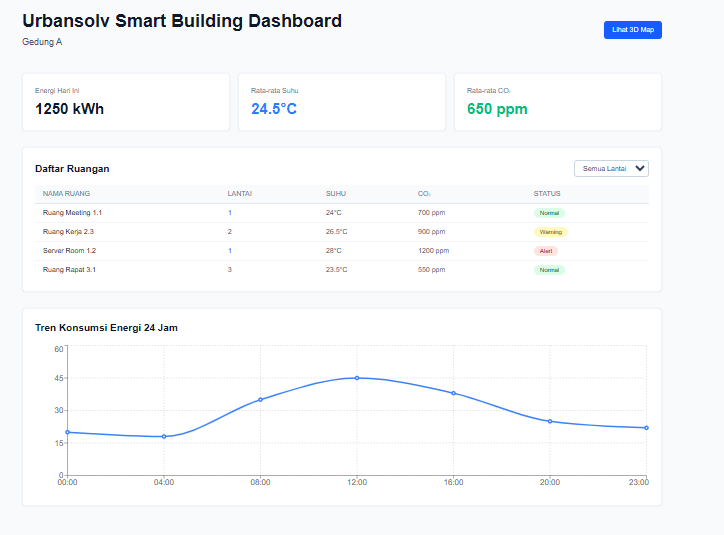
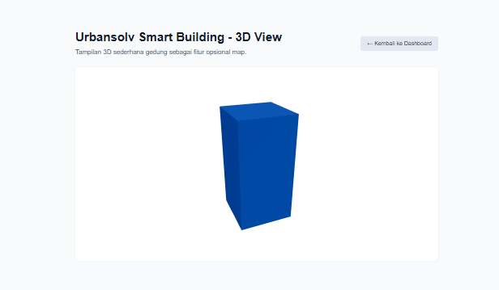

# Urbansolv Smart Building Dashboard

Test case frontend Urbansolv untuk membangun halaman dashboard monitoring smart building menggunakan Next.js dan Tailwind CSS.

## Tech Stack

- Next.js 14 (App Router)
- React
- Tailwind CSS
- Recharts (grafik tren energi)
- React Three Fiber & @react-three/drei (3D box sederhana untuk map)

## Cara Menjalankan Aplikasi

1. Clone repository ini atau download ZIP.
2. Masuk ke folder frontend:

   ```
   cd frontend
   ```

3. Install dependency:

   ```
   npm install
   ```

4. Jalankan development server:

   ```
   npm run dev
   ```

5. Buka di browser:

   - Dashboard: `http://localhost:3000`
   - Halaman 3D Map: `http://localhost:3000/map`

## Fitur Utama

### 1. Smart Building Dashboard

Halaman utama menampilkan:

- Header dengan judul **"Urbansolv Smart Building Dashboard"** dan nama gedung (contoh: Gedung A).
- Tiga KPI cards:
  - Total konsumsi energi hari ini (kWh).
  - Rata-rata suhu ruangan (°C).
  - Rata-rata CO₂ (ppm) / kualitas udara.
- Tabel daftar ruangan:
  - Kolom: Nama Ruang, Lantai, Suhu, CO₂, Status (Normal / Warning / Alert).
  - Dropdown filter lantai, isi tabel menyesuaikan pilihan lantai.
  - Badge warna untuk status (hijau, kuning, merah).
- Grafik tren konsumsi energi 24 jam terakhir menggunakan Recharts.

### 2. 3D Map View

Halaman `/map` menampilkan:

- Judul **"Urbansolv Smart Building - 3D View"**.
- 3D box sederhana yang mewakili gedung dengan kontrol rotate/zoom menggunakan React Three Fiber.
- Tombol untuk kembali ke dashboard utama.

## Struktur Folder

Struktur utama di dalam folder `frontend`:

```
frontend/
├─ app/
│  ├─ layout.js          # Root layout Next.js
│  ├─ page.jsx           # Halaman dashboard utama
│  └─ map/
│     └─ page.jsx        # Halaman 3D map
├─ components/
│  ├─ KPICards.jsx       # Kartu ringkasan KPI
│  ├─ RoomsTable.jsx     # Tabel daftar ruangan + filter lantai
│  └─ EnergyChart.jsx    # Grafik tren konsumsi energi
├─ lib/
│  └─ data.js            # Dummy data building, rooms, energyTrend
├─ public/
│  ├─ dashboard.png      # Screenshot dashboard utama
│  └─ map.png            # Screenshot halaman 3D map
└─ README.md
```

## Screenshots

Dashboard utama:



Halaman 3D Map:


